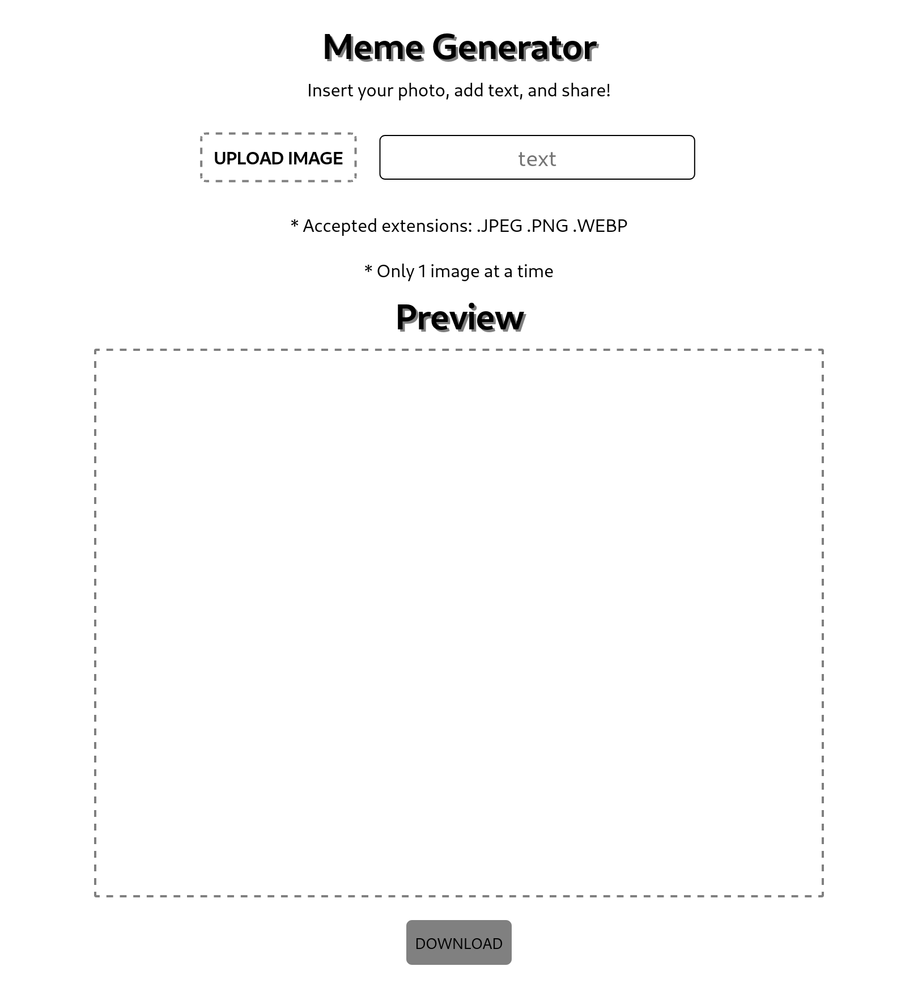

# Project Meme Generator

## Link

[meme-generator.vercel](https://paulo-meme-generator.vercel.app/)

## About

This is my 5th project during my journey at Trybe!

The Meme Generator is an application that allows users to create custom memes! This is a side project to continue improving my skills in HTML, CSS, and JS. In this project, I had the opportunity to work with input manipulation and logic so that users can upload local files, convert images to base64 to be saved in localStorage, and allow users to download the created meme using basic browser compression.

## Repository Structure

- The `src` folder contains all the code

## Implemented Features

## Implemented text and image inputs

  

    The page contains an input for entering text and another for uploading an image
  
  

- The text input has the `id` named `text-input` and is limited to 60 characters

- The image input has the `id` named `image-input`, and does not accept multiple files

- `image-input` only accepts image files (.JPG .PNG .WEBP)

- A limit of 3MB was set for the size of the image that can be inserted

- If a file of the wrong type or larger than the accepted size is inserted, an error message will be displayed

## Implemented a preview for the inserted image and text

  

    The page contains an area with a meme preview
  
  

- The preview has an element with the `id` named `meme-text` corresponding to the text inserted in the `text-input` input

- The preview has an element with the `id` named `meme-image` corresponding to the image inserted in the `image-input` input

- The image is fully contained within the preview display, and the text is overlaid on the image

## Implemented LocalStorage for the inserted image and text

  

    The image and text inserted by the user are saved in localStorage
  
  

- The text is saved in localStorage with the key `memeText`

- The image is saved in localStorage with the key `memeImage`

- localStorage only accepts `string`, so the image is encoded in **base64**

## Implemented a button for downloading the created meme

  

    The page features a button to download the created meme
  
  

- The button has the `id` named `download-btn` and is located below the preview with the text **Download Meme**

- The button remains disabled until an image is uploaded

- The created meme has dimensions *600x400* and the filename is always **meme.jpg**

- If the image does not have dimensions 600x400, the background is filled with the color **white**

---
